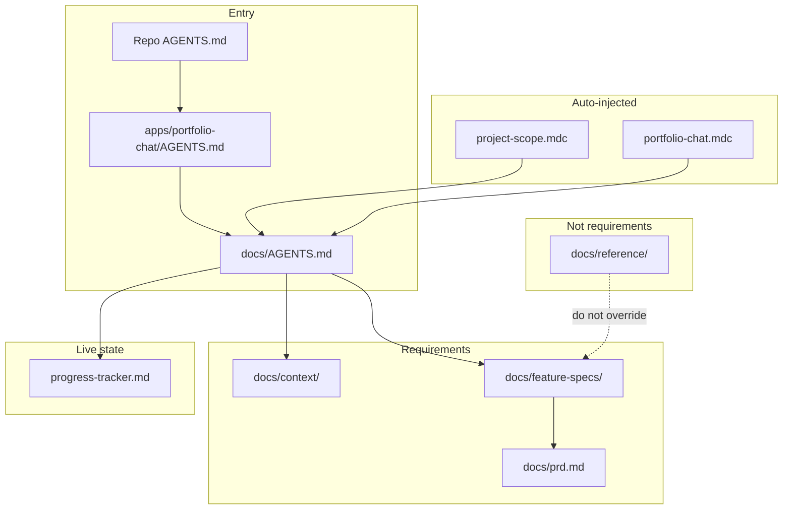

# How agent documentation fits together

Portfolio Chat uses a **spec-driven** layout so Cursor agents know what to read, what to build, and what to update after each change.

## Layers

| Layer | Path | Purpose |
|-------|------|---------|
| **AGENTS chain** | `AGENTS.md` → `apps/portfolio-chat/AGENTS.md` → `docs/AGENTS.md` | Where to read, how to behave |
| **Cursor rules** | `.cursor/rules/project-scope.mdc`, `portfolio-chat.mdc`, `prefers-hooks.mdc` | Scope + tracker discipline |
| **Context** | `docs/context/` | Cross-cutting facts (architecture, UI, standards) |
| **Feature specs** | `docs/feature-specs/` | Per-feature requirements + `00-index.md` registry |
| **PRD** | `docs/prd.md` | Product-level living doc |
| **Progress tracker** | `docs/context/progress-tracker.md` | Current goal, in progress, completed |
| **Reference** | `docs/reference/` | Learn-by-reading — **not** specs |

## Conflict resolution

1. `docs/feature-specs/NN-*.md`
2. `docs/context/architecture.md` + `code-standards.md`
3. `docs/prd.md`
4. Never: `docs/reference/` or old narrative docs alone

## Workflow snapshot

1. **Start** — Read `docs/AGENTS.md` + `progress-tracker.md` + relevant row in `feature-specs/00-index.md`
2. **Implement** — Match spec; new domains under `features/<name>/`
3. **End** — Update tracker; update index Status if shipped; run `pnpm typecheck`

## Index vs tracker

- **00-index.md** — permanent feature map (what exists, where code lives, spec link)
- **progress-tracker.md** — session state (what we're doing *now*)

## Scope (this repo)

Agents are confined to **`apps/portfolio-chat/`** unless the user expands scope. `.cursorignore` hides other apps and all `packages/` from the index.
